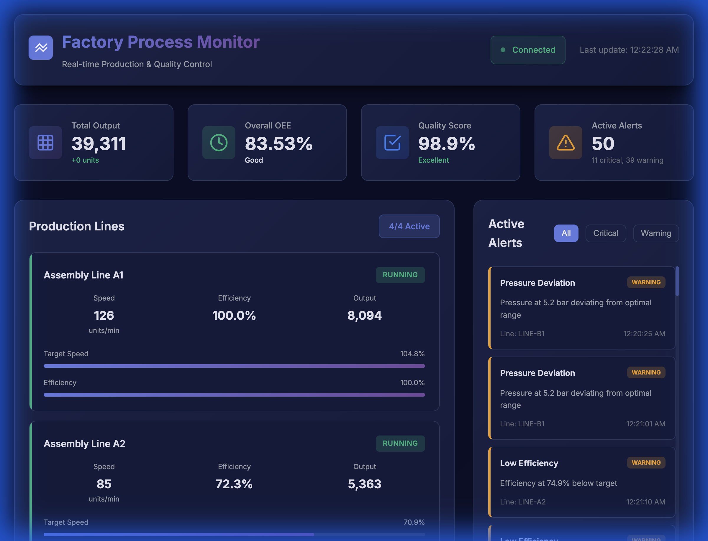
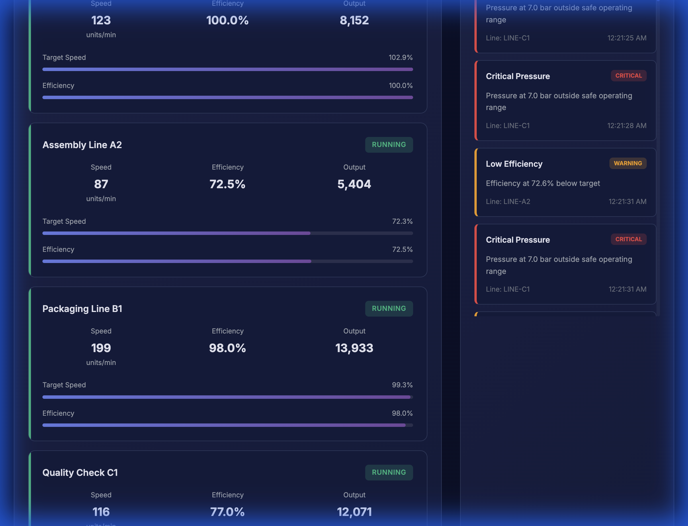
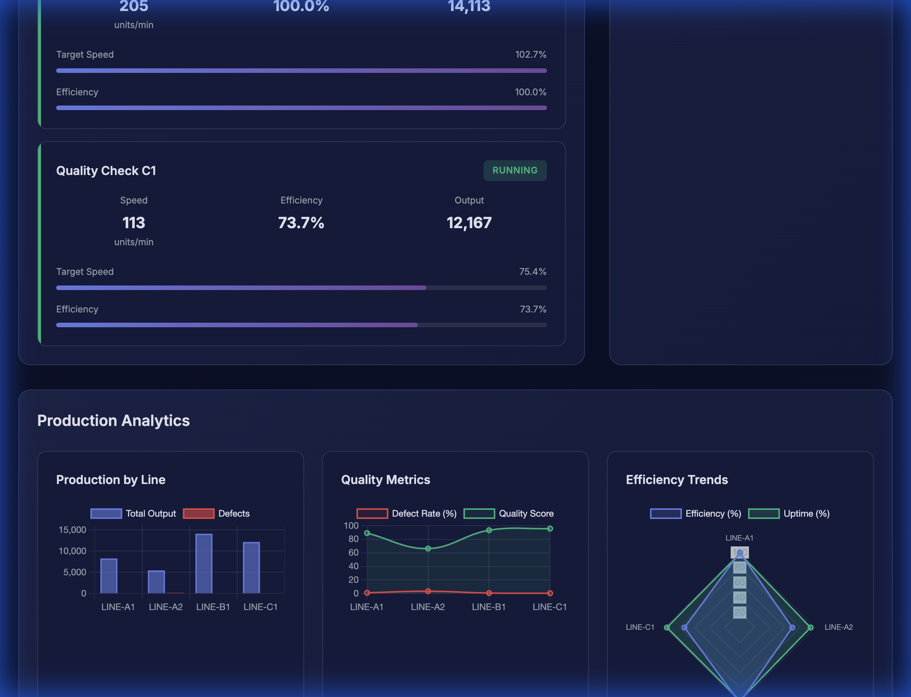
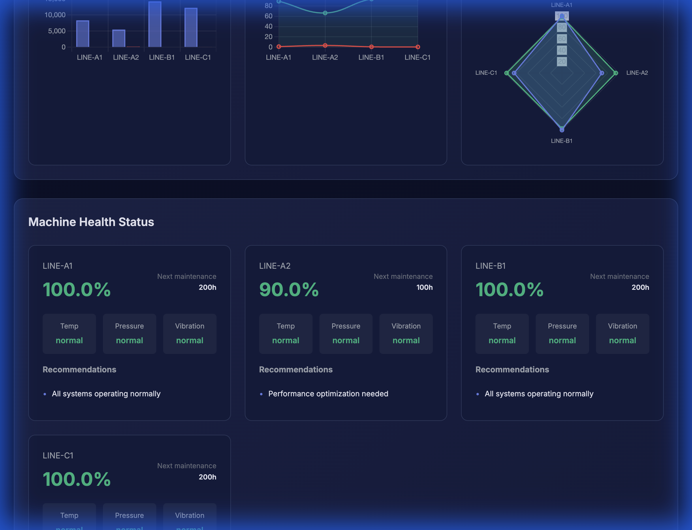

# Factory Process Monitoring Agent

# Sharan G S
A comprehensive real-time manufacturing monitoring system that tracks production lines, ensures quality control, detects anomalies, and provides actionable insights for optimal factory operations.


## Screenshots

### Dashboard Overview

*Real-time production monitoring dashboard with overall metrics, connection status, and active alerts*

### Production Lines Monitoring

*Live tracking of multiple production lines with speed, efficiency, and output metrics*

### Analytics & Charts

*Visual analytics including production by line, quality metrics, and efficiency trends*

### Machine Health Status

*Machine health monitoring with predictive maintenance recommendations*

## Features

### 🏭 Real-Time Production Monitoring
- **Multi-line tracking**: Monitor multiple production lines simultaneously
- **Live metrics**: Real-time speed, efficiency, and output tracking
- **OEE calculation**: Overall Equipment Effectiveness monitoring
- **Status indicators**: Visual status updates (running, idle, maintenance, error)

### 🎯 Quality Control
- **Defect tracking**: Automatic defect detection and categorization
- **Quality metrics**: Pass/fail ratios, defect rates, and quality scores
- **Trend analysis**: Quality trend identification (improving, stable, declining)
- **Statistical analysis**: Defect type distribution and analysis

### 🚨 Intelligent Anomaly Detection
- **Multi-parameter monitoring**: Temperature, pressure, vibration tracking
- **Threshold-based alerts**: Configurable warning and critical thresholds
- **Automated notifications**: Real-time alert generation
- **Alert prioritization**: Critical, warning, and info severity levels

### 🔧 Machine Health Monitoring
- **Health scoring**: 0-100 health score for each production line
- **Predictive maintenance**: Estimated hours until next maintenance
- **Component status**: Individual monitoring of temperature, pressure, vibration
- **Recommendations**: Actionable maintenance recommendations

### 📊 Analytics & Reporting
- **Production charts**: Visual representation of output by line
- **Quality visualization**: Defect rates and quality score trends
- **Efficiency radar**: Multi-dimensional efficiency comparison
- **Real-time dashboards**: Live updating analytics

## Technology Stack

- **Backend**: Flask (Python) with WebSocket support
- **Frontend**: Vanilla JavaScript with Chart.js
- **Real-time Communication**: Socket.IO
- **Data Processing**: NumPy, Pandas
- **Styling**: Modern CSS with glassmorphism effects

## Installation

### Prerequisites
- Python 3.8 or higher
- pip (Python package manager)

### Setup Instructions

1. **Clone or navigate to the project directory**
   ```bash
   cd "/Users/sharan/Downloads/Factory Process Monitoring Agent"
   ```

2. **Install dependencies**
   ```bash
   pip install -r requirements.txt
   ```

3. **Run the application**
   ```bash
   python app.py
   ```

4. **Access the dashboard**
   Open your browser and navigate to:
   ```
   http://localhost:5000
   ```

## Usage

### Dashboard Overview

The main dashboard provides a comprehensive view of your factory operations:

1. **Overall Metrics** (Top Section)
   - Total production output
   - Overall OEE percentage
   - Quality score
   - Active alerts count

2. **Production Lines** (Left Panel)
   - Individual line status and metrics
   - Real-time speed and efficiency
   - Progress bars for performance tracking

3. **Active Alerts** (Right Panel)
   - Filterable alert list (All, Critical, Warning)
   - Alert details with timestamps
   - Severity indicators

4. **Analytics Charts** (Middle Section)
   - Production output by line (Bar chart)
   - Quality metrics trends (Line chart)
   - Efficiency comparison (Radar chart)

5. **Machine Health** (Bottom Section)
   - Health scores for each line
   - Component status indicators
   - Maintenance predictions
   - Actionable recommendations

### API Endpoints

#### Production Data
- `GET /api/production-lines` - Get all production lines
- `GET /api/production-lines/<line_id>` - Get specific line data
- `GET /api/overall-metrics` - Get overall production metrics

#### Quality Control
- `GET /api/quality-metrics` - Get quality metrics for all lines
- `GET /api/quality-summary` - Get overall quality summary

#### Alerts
- `GET /api/alerts` - Get all active alerts
- `POST /api/alerts/<alert_id>/acknowledge` - Acknowledge an alert
- `POST /api/alerts/<alert_id>/resolve` - Resolve an alert

#### Machine Health
- `GET /api/machine-health` - Get health data for all lines
- `GET /api/machine-health/<line_id>` - Get health data for specific line

#### Analytics
- `GET /api/analytics` - Get comprehensive analytics data

## Architecture

### Backend Components

- **`app.py`**: Main Flask application with WebSocket support
- **`production_monitor.py`**: Production line simulation and monitoring
- **`quality_control.py`**: Quality metrics calculation and analysis
- **`anomaly_detector.py`**: Anomaly detection and alert generation
- **`data_models.py`**: Data structures and models

### Frontend Components

- **`templates/index.html`**: Main dashboard HTML structure
- **`static/styles.css`**: Modern industrial styling
- **`static/script.js`**: Real-time updates and interactivity

## Configuration

### Alert Thresholds

Default thresholds can be modified in `anomaly_detector.py`:

```python
self.thresholds = {
    "temperature": {"warning": 38, "critical": 42},
    "pressure": {"warning_low": 5.2, "warning_high": 6.8},
    "vibration": {"warning": 3.0, "critical": 3.5},
    "efficiency": {"warning": 75, "critical": 65},
    "defect_rate": {"warning": 5.0, "critical": 8.0}
}
```

### Production Lines

Production lines can be configured in `production_monitor.py`:

```python
line_configs = [
    {"id": "LINE-A1", "name": "Assembly Line A1", "target": 120.0},
    {"id": "LINE-A2", "name": "Assembly Line A2", "target": 120.0},
    # Add more lines as needed
]
```

## Key Metrics Explained

### Overall Equipment Effectiveness (OEE)
OEE = Availability × Performance × Quality

- **Availability**: Uptime percentage
- **Performance**: Current efficiency vs. target
- **Quality**: Good units / Total units produced

### Health Score
Calculated based on:
- Temperature status (normal/warning/critical)
- Pressure status (normal/warning/critical)
- Vibration status (normal/warning/critical)
- Overall efficiency

Score ranges:
- **85-100**: Excellent health
- **70-84**: Good health, minor issues
- **Below 70**: Critical, requires immediate attention

## Troubleshooting

### Connection Issues
- Ensure the Flask server is running on port 5000
- Check firewall settings
- Verify WebSocket connection in browser console

### No Data Displaying
- Refresh the browser page
- Check browser console for errors
- Verify backend is running without errors

### Performance Issues
- Reduce update frequency in `app.py` (default: 3 seconds)
- Limit number of production lines
- Clear browser cache

## Future Enhancements

- [ ] Historical data storage and retrieval
- [ ] Advanced predictive maintenance algorithms
- [ ] Multi-factory support
- [ ] User authentication and role-based access
- [x] Export reports to PDF/Excel ✅ **COMPLETED**
- [ ] Mobile responsive design improvements
- [ ] Integration with real production line sensors

## License

MIT License - feel free to use this project for your manufacturing operations.

## Support

For issues, questions, or contributions, please refer to the project documentation or contact the development team.

---

**Built with ❤️ for modern manufacturing operations**
